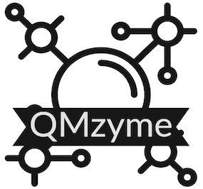

[![Powered by MDAnalysis](https://img.shields.io/badge/Powered%20by-MDAnalysis-orange.svg?logoWidth=16&logo=data:image/x-icon;base64,AAABAAEAEBAAAAEAIAAoBAAAFgAAACgAAAAQAAAAIAAAAAEAIAAAAAAAAAAAAAAAAAAAAAAAAAAAAAAAAAAAAAAAAJD+XwCY/fEAkf3uAJf97wGT/a+HfHaoiIWE7n9/f+6Hh4fvgICAjwAAAAAAAAAAAAAAAAAAAAAAAAAAAAAAAACT/yYAlP//AJ///wCg//8JjvOchXly1oaGhv+Ghob/j4+P/39/f3IAAAAAAAAAAAAAAAAAAAAAAAAAAAAAAAAAAAAAAJH8aQCY/8wAkv2kfY+elJ6al/yVlZX7iIiI8H9/f7h/f38UAAAAAAAAAAAAAAAAAAAAAAAAAAB/f38egYF/noqAebF8gYaagnx3oFpUUtZpaWr/WFhY8zo6OmT///8BAAAAAAAAAAAAAAAAAAAAAAAAAAAAAAAAgICAn46Ojv+Hh4b/jouJ/4iGhfcAAADnAAAA/wAAAP8AAADIAAAAAwCj/zIAnf2VAJD/PAAAAAAAAAAAAAAAAICAgNGHh4f/gICA/4SEhP+Xl5f/AwMD/wAAAP8AAAD/AAAA/wAAAB8Aov9/ALr//wCS/Z0AAAAAAAAAAAAAAACBgYGOjo6O/4mJif+Pj4//iYmJ/wAAAOAAAAD+AAAA/wAAAP8AAABhAP7+FgCi/38Axf4fAAAAAAAAAAAAAAAAiIiID4GBgYKCgoKogoB+fYSEgZhgYGDZXl5e/m9vb/9ISEjpEBAQxw8AAFQAAAAAAAAANQAAADcAAAAAAAAAAAAAAAAAAAAAAAAAAAAAAAAAAAAAjo6Mb5iYmP+cnJz/jY2N95CQkO4pKSn/AAAA7gAAAP0AAAD7AAAAhgAAAAEAAAAAAAAAAACL/gsAkv2uAJX/QQAAAAB9fX3egoKC/4CAgP+NjY3/c3Nz+wAAAP8AAAD/AAAA/wAAAPUAAAAcAAAAAAAAAAAAnP4NAJL9rgCR/0YAAAAAfX19w4ODg/98fHz/i4uL/4qKivwAAAD/AAAA/wAAAP8AAAD1AAAAGwAAAAAAAAAAAAAAAAAAAAAAAAAAAAAAALGxsVyqqqr/mpqa/6mpqf9KSUn/AAAA5QAAAPkAAAD5AAAAhQAAAAEAAAAAAAAAAAAAAAAAAAAAAAAAAAAAADkUFBSuZ2dn/3V1df8uLi7bAAAATgBGfyQAAAA2AAAAMwAAAAAAAAAAAAAAAAAAAAAAAAAAAAAAAAAAAB0AAADoAAAA/wAAAP8AAAD/AAAAWgC3/2AAnv3eAJ/+dgAAAAAAAAAAAAAAAAAAAAAAAAAAAAAAAAAAAAAAAAA9AAAA/wAAAP8AAAD/AAAA/wAKDzEAnP3WAKn//wCS/OgAf/8MAAAAAAAAAAAAAAAAAAAAAAAAAAAAAAAAAAAAIQAAANwAAADtAAAA7QAAAMAAABUMAJn9gwCe/e0Aj/2LAP//AQAAAAAAAAAA)](https://www.mdanalysis.org)

[comment]:  <>

*QMzyme is currently under-development. Please note the user interface may change! The first stable API version will be released as QMzyme==1.0.0 on PyPi.*

QMzyme is a Python toolkit to facilitate (quantum mechanical) QM-based enzyme calculations. The GenerateModel module guides the process of generating calculation ready truncated or partitioned molecule regions. Any input file(s) accepted by [MDAnalysis to create a Universe](https://userguide.mdanalysis.org/stable/universe.html) object can be used to start working in QMzyme. From there, the code relies on more flexible QMzyme objects: QMzymeAtom, QMzymeResidue, QMzymeRegion and QMzymeModel. 

Full documentation with installation instructions, technical details and examples can be found in [Read the Docs](https://qmzyme.readthedocs.io/).

## Contributing to QMzyme
For suggestions and improvements of the code (greatly appreciated!), please reach out through the issues and pull requests options of Github. See documentation about [contributing guidelines](https://qmzyme.readthedocs.io/en/latest/Contributing/index.html).

## Current Contributors
* Heidi Klem, NIST (main developer)
* Demian Riccardi, NIST

## References
QMzyme has not been formally published. Please refer back here for the proper citation once it has.

QMzyme's main dependency is MDAnalysis. When using QMzyme please [cite MDAnalysis accordingly](https://www.mdanalysis.org/pages/citations/):

* R. J. Gowers, M. Linke, J. Barnoud, T. J. E. Reddy, M. N. Melo, S. L. Seyler, D. L. Dotson, J. Domanski, S. Buchoux, I. M. Kenney, and O. Beckstein. MDAnalysis: A Python package for the rapid analysis of molecular dynamics simulations. In S. Benthall and S. Rostrup, editors, Proceedings of the 15th Python in Science Conference, pages 98-105, Austin, TX, 2016. SciPy, doi:10.25080/majora-629e541a-00e.

* N. Michaud-Agrawal, E. J. Denning, T. B. Woolf, and O. Beckstein. MDAnalysis: A Toolkit for the Analysis of Molecular Dynamics Simulations. J. Comput. Chem. 32 (2011), 2319-2327, doi:10.1002/jcc.21787. PMCID:PMC3144279

If you use QMzyme to write QM software calculation input files, please include this citation for [AQME](https://aqme.readthedocs.io/en/latest/):  

* Alegre-Requena, J. V.; Sowndarya, S.; Pérez-Soto, R.; Alturaifi, T.; Paton, R. AQME: Automated Quantum Mechanical Environments for Researchers and Educators. Wiley Interdiscip. Rev. Comput. Mol. Sci. 2023, 13, e1663. (DOI: 10.1002/wcms.1663).  

### Acknowledgements
MolSSI for providing the [CMS Cookiecutter](https://github.com/molssi/cookiecutter-cms) that informed initial project architecture.

We really THANK all the testers for their feedback, including:

* **Helena Giramé** (2024, Feixas and Garcia-Borràs groups at University of Girona, IQCC)
* **Cristina Berga** (2024, Feixas and Garcia-Borràs groups at University of Girona, IQCC)
* **Aqza Elza John** (2024, Feixas and Garcia-Borràs groups at University of Girona, IQCC)
* **Hande Abeş** (2024, Feixas and Garcia-Borràs groups at University of Girona, IQCC)
* **Raul Perez-Soto** (2024, Kim group at Colorado State University)
* **Alex Platt** (2024, Paton group at Colorado State University)

We greatly acknowledge HPC resources obtained through ACCESS:
* Timothy J. Boerner, Stephen Deems, Thomas R. Furlani, Shelley L. Knuth, and John Towns. 2023. ACCESS: Advancing Innovation: NSF’s Advanced Cyberinfrastructure Coordination Ecosystem: Services & Support. “In Practice and Experience in Advanced Research Computing (PEARC ’23)”, July 23–27, 2023, Portland, OR, USA. ACM, New York, NY, USA, 4 pages. https://doi.org/10.1145/3569951.3597559.
* This work used Expanse at SDSC through allocation BIO230144 from the Advanced Cyberinfrastructure Coordination Ecosystem: Services & Support (ACCESS) program, which is supported by National Science Foundation grants #2138259, #2138286, #2138307, #2137603, and #2138296.

#### Copyright
Copyright (c) 2024, Heidi Klem

