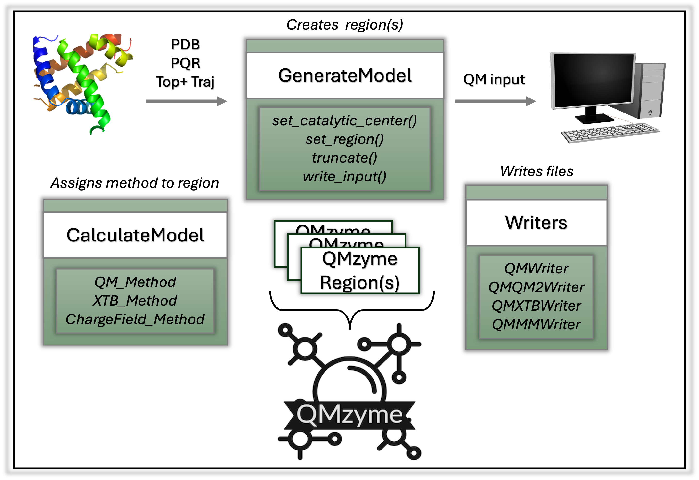

Main Modules
-------------

|schema|

The GenerateModel, CalculateModel, and Writers modules communicate to 
create a calculation ready QMzymeModel. 

.. toctree::
   :maxdepth: 1

   QMzyme.GenerateModel
   QMzyme.SelectionSchemes
   QMzyme.TruncationSchemes
   QMzyme.CalculateModel
   QMzyme.Writers

Data Structures
---------------------------------------

Modules for constructing QMzyme objects.

.. toctree::
   :maxdepth: 1

   QMzyme.QMzymeAtom
   QMzyme.QMzymeResidue
   QMzyme.QMzymeModel
   QMzyme.QMzymeRegion
   QMzyme.RegionBuilder
	

Other Modules
--------------

.. toctree::
   :maxdepth: 1

   QMzyme.utils
   QMzyme.truncation_utils
   QMzyme.aqme.qprep
   QMzyme.MDAnalysisWrapper
